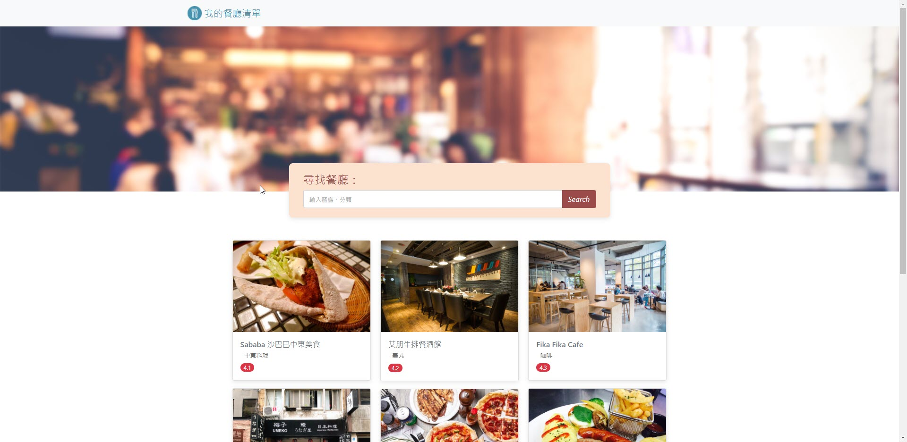

# 我的餐廳清單



## 介紹

新增&查詢&確認&刪除自己的餐廳清單，可以建立&瀏覽餐廳、查看詳細資訊或是刪除餐廳。

### 功能

- 新增餐廳
- 查看所有餐廳
- 瀏覽餐廳的詳細資訊
- 搜尋特定餐廳

## 開始使用

1. 將專案 clone 到本地

   ```bash
   git clone https://github.com/Eli-WL/Restaurant_List.git
   ```

2. 在本地開啟之後，透過終端機進入資料夾，輸入：

   ```bash
   npm install
   ```

3. 確認express-handlebars 為5.3.4以下的版本，若不是輸入以下指令安裝

   ```bash
   npm i express-handkebars @ 5.3.4
   ```


4. 確認環境與下列開發環境相同後，輸入：

   ```bash
   npm run seed
   ```

5. 若看見此行訊息則代表順利將restaurant.json匯入資料庫

   ```bash
   mongodb connected!
   create done!
   ```

6. 確認環境與下列開發環境相同後，輸入：

   ```bash
   npm run dev
   ```

7. 若看見此行訊息則代表順利運行，打開瀏覽器進入到以下網址

   ```bash
   Listening on http://localhost:3000
   ```

8. 停止server運作

   ```bash
   ctrl + c
   ```

## 開發工具

- Node.js 14.16.0
- Express 4.17.1
- Express-Handlebars 5.3.4
- mongoose 6.1.7
- body-parser 1.19.1


## Contributor
Eli Lin